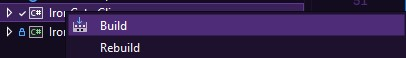
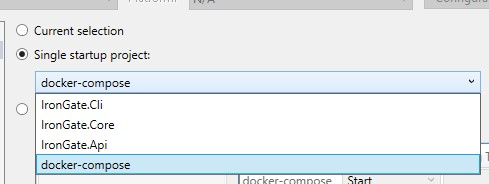
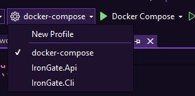
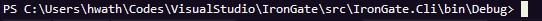

# IronGate
3971157
IronGate is a security-focused learning and experimentation project that demonstrates password-based authentication, defensive controls, and controlled attack simulations against a local lab environment. It includes:

- An API server that implements authentication and defenses (hashing variants, pepper, rate limiting, lockout, CAPTCHA, optional TOTP).
- A database layer (persistent storage for users, password hashes, attempts/messages as relevant).
- A CLI tool for user operations and for running controlled attack simulations (brute-force and password spraying).
- Seed datasets and configuration profiles for repeatable comparisons.

This repository is intended for education, testing, and research in a controlled environment only.
To see our thought process, check out:
``https://docs.google.com/document/d/1y9GAkvzMeREG348OgO-jRU4kgLXtTK8E_ooSjLuyAz0/edit?tab=t.0``

---

## Repository layout

Typical layout (names may differ slightly per solution):

- `src/IronGate.Api/`  
  Web API server (endpoints for register/login/config/captcha, etc.)
- `src/IronGate.Core/` 
  Database / persistence layer (EF Core, migrations, DB context, repositories)
- `src/IronGate.Cli/`  
  Command line tool for interacting with API + running attacks
- `docs/`  
  Includes all the documents required in the assignment (Logs, video, ppt)

---

## Getting Started

### Prerequisites
- Docker Desktop (Windows/macOS/Linux)
- .NET 9 SDK
- Visual Studio 2022 or VS Code

### Setup

```bash
git clone https://github.com/<your-username>/IronGate.git
cd Irongate
```

## Running the Project
Before approaching the different options, make sure the folder `/src/IronGate.Core/Migrations` is NOT empty.

If, for some reason, it is - run the following command:

`dotnet ef migrations add InitialCreate -p src/IronGate.Core -s src/IronGate.Api`


### Running via Visual Studio
1. Open the solution file `IronGate.sln`.

2. Right click on the `IronGate.Cli` project, and click `Build`.

 
3. Right click on the solution and choose `Configure Startup Projects`.


4. Choose docker-compose project as the only start options, then click `apply`.


5. Choose your new profile (or docker-compose) and run.


6. Navigate in your terminal to `/src/IronGate.Cli/bin/Debug` (or /Release deppending on what build you chose)


7. You can now access the CLI and use the attacks. Run it once via `.\Irongate.exe` in order to get the help menu printed.


## Core concepts

### Users and password strength groups

The project uses 3 user categories to represent password strength:

- `weak` - Either only numbers or only letters.
- `medium` - Numbers & letters.
- `hard` - Numbers, letters & special symbols.

These are used to seed accounts and to compare how defenses behave under different attack strategies.

### Defensive controls (server configuration)

The server configuration typically includes:

- Password hashing algorithm:
  - `bcrypt`
  - `argon2id`
  - `sha256`
- Pepper:
  - `pepperEnabled: true/false`
- Rate limiting:
  - `rateLimitEnabled: true/false`
  - `maxAttemptsPerUser`
  - `rateLimitWindowSeconds`
- Lockout:
  - `lockoutEnabled: true/false`
  - `lockoutThreshold`
- CAPTCHA:
  - `captchaEnabled: true/false`
  - `captchaAfterFailedAttempts` 

---

## API server (high-level)

The API is the source of truth for:

- registration
- login verification
- defense controls enforcement (rate limit, lockout, CAPTCHA, TOTP)
- config management
- issuing CAPTCHA tokens

Endpoints differ per implementation, but the CLI expects the API to provide:

- register
- login
- config get/set
- captcha token issuance

---

## CLI (IronGate.Cli)

IronGate.Cli is the main user interface for:

- running normal user flows (register/login)
- setting and reading the server configuration
- issuing CAPTCHA tokens for a group seed
- running controlled attack simulations (brute-force, spraying)

### Commands

The CLI supports:

```text
register <username> <password>
config get
config set <pathToJson>
captcha create <groupSeed>
login <username> <password> <totp_secret> <captcha>
login <username> <password> <totp_secret> -
login <username> <password> - <captcha>
attack brute-force <username>
attack spray <usernamesFile> <passwordFile> <thread_amount>
```

`Note:` Login commands must receive 4 variables. If you do not have an input, use `-` as a filler.
`Note:` Password-Spray runs with a default of 4 threads, and at a maximum of 32 threads.


### Ethical Statement
IronGate is intended for education, research, and security testing in controlled environments only.

You may use it only against systems you own or have explicit written permission to test. Do not use it to gain unauthorized access, disrupt services, exfiltrate data, or harm people or infrastructure.

You are responsible for complying with all applicable laws, regulations, and organizational policies. Run experiments safely: keep strict limits enabled, collect logs, and ensure complete separation between your lab environment and any real systems.